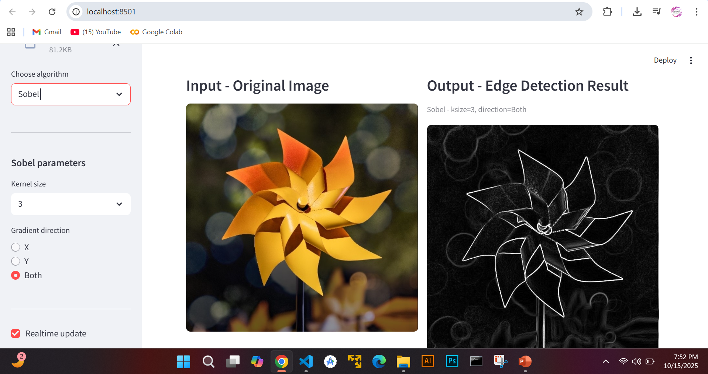
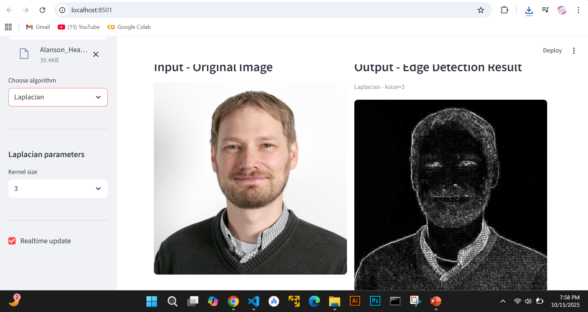
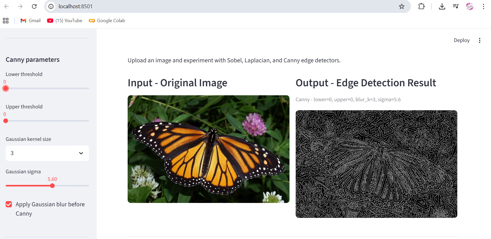

# Interactive Edge Detection UI

An interactive web-based application built using **Python**, **OpenCV**, and **Streamlit** that allows users to experiment with different **edge detection algorithms**.  
Users can upload an image, select an algorithm (Sobel, Laplacian, or Canny), adjust its parameters, and instantly visualize the results side by side with the original image.

---

## Project Description

This project is an interactive web application built using Python, OpenCV, and Streamlit that demonstrates how different edge detection algorithms work.
Users can upload any image, select an algorithm, and adjust parameters to see how edges are detected in real time.
The original and processed images are shown side by side for easy comparison and better understanding.
The **Sobel operator** detects edges by calculating image gradients in horizontal and vertical directions.
The **Laplacian operator** highlights regions of rapid intensity change using second-order derivatives.
The **Canny edge detector** is more advanced and uses Gaussian smoothing and thresholding for cleaner and more accurate edges.

---

## Setup and Installation

### 1. Clone the repository
```bash
git clone https://github.com/yashfa157/Interactive-Edge-Detection-UI.git
cd Interactive-Edge-Detection-UI
```

### 2. Create and activate a virtual environment

## Windows:

```bash
python -m venv venv
venv\Scripts\activate
```
## Mac/Linux:
```bash
python3 -m venv venv
source venv/bin/activate
```
### 3. Install required dependencies
```bash
pip install -r requirements.txt
```

Once dependencies are installed, start the Streamlit app with:
```bash
streamlit run edge_detection_ui.py
```
Then open the local URL shown in the terminal.

### Features Implemented

- **Image Upload:** Supports JPG, PNG, and BMP formats.
- **Edge Detection Algorithms:**
  - **Sobel** – adjustable kernel size and gradient direction (X, Y, or Both)
  - **Laplacian** – adjustable kernel size
  - **Canny** – adjustable thresholds, Gaussian kernel size, and sigma
- **Parameter Adjustment UI:** Uses sliders, dropdowns, and radio buttons for easy tuning.
- **Real-time Updates:** Output refreshes instantly when parameters change.
- **Side-by-side Display:** Original and processed images are shown side by side.
- **Clean & Responsive UI:** Designed with Streamlit for an intuitive user experience.


## Screenshots


Below are the visual results of each edge detection algorithm.
Each image shows the original input (left) and the edge-detected output (right) side by side.

### Sobel Edge Detection

.png)
.png)


### Laplacian Edge Detection

.png)

### Canny Edge Detection

.png)
.png)


### Author

- **Name:** Yashfa Najam  
- **Course:** Computer Vision  
- **Project:** Edge Detection Algorithms Visualization  
- **GitHub Repo:** [Interactive Edge Detection UI](https://github.com/yashfa157/Interactive-Edge-Detection-UI)
